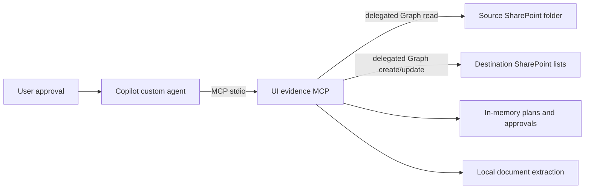

# Architecture

## Trust boundaries

The MCP process is the policy enforcement boundary. Prompt instructions reinforce the
workflow but are not the only guardrail:

- `SharePointSourceReader` exposes list and download operations only.
- `DestinationWriter` exposes lookup, create, and update operations only.
- no adapter or MCP tool exposes delete;
- apply requires an unexpired plan, exact digest, explicit confirmation phrase, same Entra
  account, and unchanged destination site ID;
- approvals are single-use, and create operations recheck their key immediately before writing;
- duplicate destination keys produce review items instead of an arbitrary update; and
- updates carry destination ETags to detect concurrent changes.

## Analysis pipeline

1. Resolve the source folder URL through the Graph shares API and preserve drive/item IDs.
2. Enumerate recursively with pagination.
3. Download supported files into bounded memory and extract locally.
4. Normalize text and apply versioned deterministic taxonomy/risk rules.
5. Emit a canonical evidence index record for every discovered item.
6. Emit explicit requirements as documented facts.
7. Emit scenarios and risks as inference with a rule-based rationale.
8. Detect simple requirement/negation contradictions and require review.
9. Compare current source keys with the same `SourceScopeKey` in the destination; mark
   missing items `unavailable` and `ReviewRequired` rather than deleting them.
10. Compare canonical destination fields and produce create/update/unchanged/review changes.

The analyzer is deliberately deterministic and does not send document content to a hosted
LLM or third-party parser. Taxonomy and rules are versioned under `config/`.

## Idempotency

`StableKey = SHA256(SourceDriveId, SourceItemId, record kind, discriminator)`.

`StableKey` is indexed and unique in each destination list. `SourceScopeKey` is indexed for
safe unavailable-source reconciliation at SharePoint list scale.

The evidence index uses one primary key per source item. Requirement and scenario
discriminators use normalized source statements; risk discriminators use versioned rule IDs.
An unchanged rerun produces `unchanged`. A changed derived representation produces
`update`. SharePoint IDs, URLs, and content are never fabricated.

## Failure model

File-level extraction and write failures are isolated and returned with the source identity
or stable key. A mixed result is `partially-succeeded`; it is never reported as success.
Unsupported, oversized, encrypted, unreadable, and unavailable evidence is retained as a
reviewable index state.
